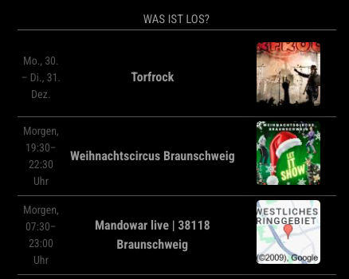

# MMM-EventSearch

Example:



The MMM-EventSearch module for [MagicMirror²] fetches and displays event information using the SerpAPI to search for events based on a given query, location, and other parameters.

To find a suitable query go to goolge and try a little for your city or surrounding city/provice/state.


## Installation

### Install

In your terminal, go to your [MagicMirror²][mm] Module folder and clone MMM-EventSearch:

```bash
cd ~/MagicMirror/modules
git clone https://github.com/ChrisF1976/MMM-EventSearch.git
```

not needed but doesn't hurt: 
```bash
cd ~/MagicMirror/modules/MMM-EventSearch
npm install
```

### Update

```bash
cd ~/MagicMirror/modules/MMM-EventSearch
git pull
```

## Using the module

To use this module, add it to the modules array in the `config/config.js` file:

```js
	{
	module: "MMM-EventSearch",
	header:"Was ist los?",
  	position: "bottom_center",
	disabled:false,
 	config: {
		apiKey: "xxxxxxxxxxx",  // Your API Key from https://serpapi.com
		location: "Germany",
		query: "braunschweig veranstaltungen morgen", //query. Try a working query for you on google
		updateInterval: 12*60*60*1000,  // Update twice a day (example)
		hl: "de",
		gl: "de",
		moduleWidth: "400px",
        	},
        },
```

## Configuration options

Option|Possible values|Default|Description
------|---------------|-------|-----------
`apiKey`|`string`|none|API key for authenticating requests to the event service. Get yours on https://serpapi.com.
`query`|`string`|`"Veranstaltungen Braunschweig"`|The search query for fetching events. Modify it to match the events you're looking for.
`location`|`string`|`"Germany"`|Location to restrict the event search to.
`updateInterval`|`integer`|`12*60*60*1000`|Interval (in milliseconds) for automatically refreshing the events list.
`hl`|`string`|`"de"`|Language for search results. Set it to the desired language code (e.g., `"en"` for English).
`gl`|`string`|`"de"`|Geolocation for search. Set it to the desired country code (e.g., `"us"` for the United States).
`googleDomain`|`string`|`"google.de"`|The Google domain to use for event search.
`moduleWidth`|`string`|`"400px"`|Configurable width for the module. You can adjust it to fit your layout.


## Credits
- Open AI
- my wife :-)

[mm]: https://github.com/MagicMirrorOrg/MagicMirror
