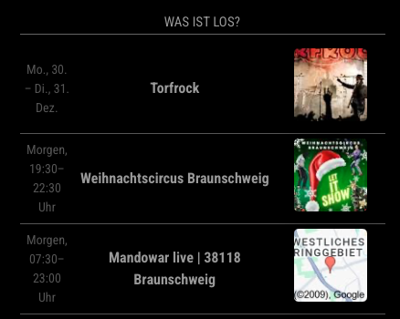

# MMM-EventSearch - regional event calendar for Braunschweig only!



The MMM-EventSearch module for [MagicMirror²](https://github.com/MagicMirrorOrg/MagicMirror) fetches and displays events from the **regional event calendar for Braunschweig only!**

The module displays the event date, time, title and image. Event titles and images link to the corresponding event page.

No API key is required.

## Installation

### Install

In your terminal, go to the MagicMirror² module folder and clone MMM-EventSearch:

```bash
cd ~/MagicMirror/modules
git clone https://github.com/ChrisF1976/MMM-EventSearch.git
cd MMM-EventSearch
npm install
```

### Update

```bash
cd ~/MagicMirror/modules/MMM-EventSearch
git pull
npm install
```

Restart MagicMirror² afterwards, for example with PM2:

```bash
pm2 restart MagicMirror
```

## Using the module

Add the module to the modules array in `config/config.js`:

```js
{
  module: "MMM-EventSearch",
  header: "Was ist los?",
  position: "bottom_left",
  disabled: false,

  config: {
    query: "",
    daysAhead: 14,
    updateInterval: 12 * 60 * 60 * 1000,
    maxResults: 5,
    maxFetchResults: 30,
    rotateMoreEvents: true,
    rotateInterval: 10 * 1000,
    animationSpeed: 500,
    moduleWidth: "400px",
    freeOnly: false,
    eventType: 0,
    venue: "0",
    userZip: "0",
    locationRange: 6,
    dayFlag: 0,
    startDate: "",
    endDate: ""
  }
},
```

## Configuration options

| Option | Default | Description |
|---|---:|---|
| `query` | `""` | Optional search term. Leave empty to show all events. |
| `daysAhead` | `14` | Number of days to fetch, starting today. |
| `updateInterval` | `12 * 60 * 60 * 1000` | Update interval in milliseconds. |
| `maxResults` | `5` | Maximum number of events shown at the same time. |
| `maxFetchResults` | `30` | Maximum number of events fetched from the calendar. |
| `rotateMoreEvents` | `true` | Enables rotation when more events are available. |
| `rotateInterval` | `10 * 1000` | Rotation interval in milliseconds. |
| `animationSpeed` | `500` | DOM update animation in milliseconds. |
| `moduleWidth` | `"400px"` | Width of the module. |
| `freeOnly` | `false` | Show only free events. |
| `eventType` | `0` | Event type. `0` shows all types. |
| `venue` | `"0"` | Venue name. `"0"` shows all venues. |
| `userZip` | `"0"` | Optional postal code for distance filtering. |
| `locationRange` | `6` | Distance setting used by the calendar. |
| `dayFlag` | `0` | Calendar day filter. `0` uses the configured date range. |
| `startDate` | `""` | Optional fixed start date in `YYYY-MM-DD` format. |
| `endDate` | `""` | Optional fixed end date in `YYYY-MM-DD` format. |

## Examples

Only concerts:

```js
query: "Konzert"
```

Only free events:

```js
freeOnly: true
```

Only events at a specific venue:

```js
venue: "Staatstheater Braunschweig"
```

## Test

```bash
cd ~/MagicMirror/modules/MMM-EventSearch
npm test
```

## Notes

The module reads events from the public calendar at [Braunschweig – Die Region](https://braunschweig.die-region.de/seiten/suche/). It depends on the HTML structure of that website. Changes to the website may require an update to the module.

## Credits

- [MagicMirror²](https://github.com/MagicMirrorOrg/MagicMirror)
- Regional event calendar Braunschweig
